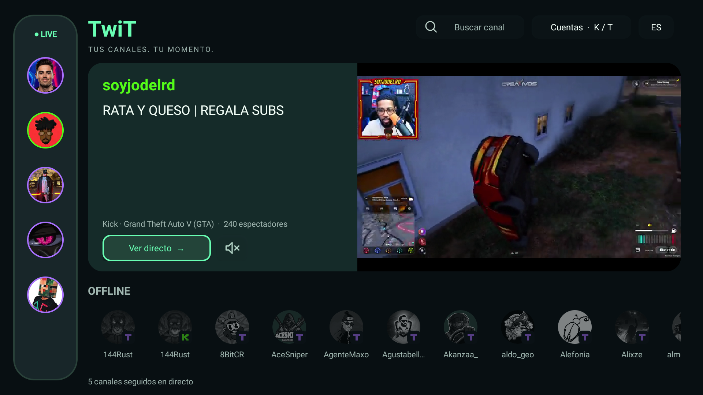
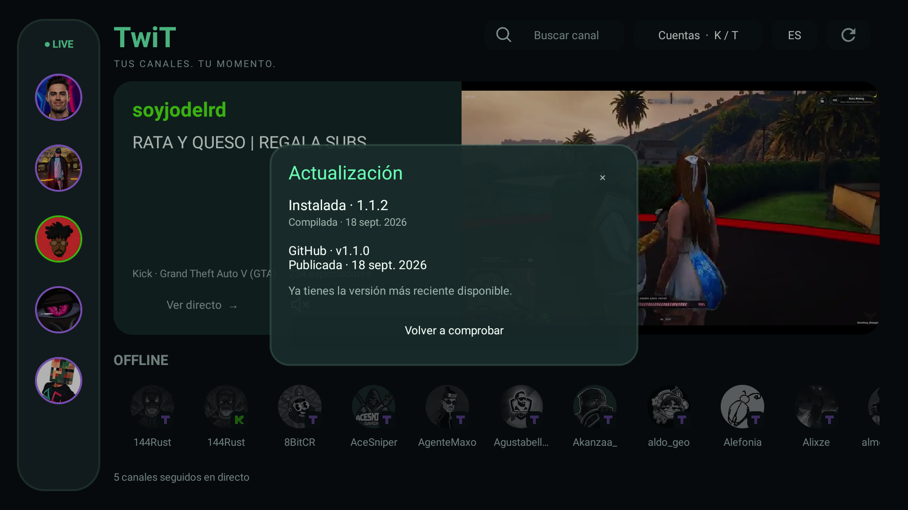

# TwiT — Twitch + Kick para Fire TV y Android TV


**Dos plataformas. Una pantalla. Hasta cuatro directos.**

TwiT reúne **Twitch y Kick en una app para Fire TV y Android TV**, con multivista (multiview), VOD y controles pensados para el mando. Creada por **DanikDeJesus**. Descarga gratuita, sin suscripción de TwiT y sin anuncios propios añadidos por la app.

**[Descargar APK](https://github.com/danikdejesus1/TwiT/releases/latest/download/TwiT.apk)** · [Última versión y notas](https://github.com/danikdejesus1/TwiT/releases/latest) · [Reportar un problema](https://github.com/danikdejesus1/TwiT/issues)

> Versión publicada: **1.1.2**. Cliente independiente y experimental; no es una app oficial de Twitch, Kick o Amazon. TwiT no garantiza eliminar los anuncios de las plataformas.

## Twitch y Kick juntos, con multivista

- **Hasta cuatro directos a la vez**, combinando canales de Twitch y Kick. Elige qué pantalla escuchar y ajusta la calidad de cada stream.
- **Tus cuentas y canales seguidos** en un mismo inicio, con preview en vivo y búsqueda de canales.
- **LIVE y OFFLINE:** aro violeta para Twitch y verde para Kick; acceso a los perfiles y a sus VOD disponibles.
- **Favoritos:** marca la estrella del perfil, incluso estando offline. Recibe un aviso breve cuando el canal se conecte mientras ves otro directo.
- **VOD con control de tiempo:** adelanta, retrocede y retoma el progreso desde Continuar viendo dentro del perfil del canal.
- **Interfaz español/inglés**, control de sonido del preview y navegación mediante mando.
- **Actualizaciones desde la app:** el icono ↻ junto al idioma consulta GitHub y permite descargar versiones posteriores con confirmación del instalador.

### Así se ve



*Inicio de TwiT. Captura de la serie 1.1; los canales y su estado cambian en directo.*



*Actualizador de la versión 1.1.2, capturado antes de publicar esa versión en GitHub.*

## Instalar con Downloader

1. Abre **Downloader** en tu Fire TV o dispositivo Android TV compatible.
2. Introduce este enlace:

   ```text
   https://github.com/danikdejesus1/TwiT/releases/latest/download/TwiT.apk
   ```

3. Si el dispositivo lo solicita, permite que Downloader instale aplicaciones y abre el APK descargado.
4. Abre TwiT y conecta tus propias cuentas desde **Cuentas**.

Para actualizar, instala sobre la versión anterior **sin desinstalarla**, conservando cuentas y ajustes. Desde 1.1.2 puedes consultar futuras versiones con ↻. El dispositivo puede pedir autorizar instalaciones desde TwiT; vuelve después al menú y confirma la instalación.

## Compatibilidad

| Dispositivo | Situación |
| --- | --- |
| Fire TV con Fire OS 7 | Probado en Fire TV HD; requiere Android 9/API 28 o posterior. |
| Android TV / Google TV | APK para dispositivos con Android 9 o posterior; compatibilidad no comprobada en todos los modelos. |
| Smart TV Samsung con Tizen | No instala este APK de forma nativa. Puedes usar un Fire TV u otro dispositivo Android compatible conectado por HDMI. |
| Smart TV LG con webOS | No instala este APK de forma nativa. Puedes usar un dispositivo compatible conectado por HDMI. |

Cuatro directos a máxima calidad pueden superar la capacidad de un Fire TV HD. Reduce la calidad o el número de pantallas si hay cortes.

## Preguntas frecuentes

### ¿Puedo ver Twitch y Kick al mismo tiempo?

Sí. La multivista permite mezclar directos de ambas plataformas, hasta cuatro pantallas, y seleccionar el audio de una de ellas.

### ¿Es una app sin anuncios?

**TwiT no añade anuncios propios.** No promete bloquear ni eliminar los anuncios de Twitch o Kick. Tampoco elimina patrocinios que un streamer incluya dentro de su vídeo. El comportamiento puede variar según la plataforma.

### ¿Es gratis?

El APK se puede descargar gratuitamente y TwiT no tiene suscripción propia. El acceso al contenido sigue sujeto a la disponibilidad y condiciones de Twitch y Kick.

### ¿Sirve para cualquier Smart TV?

No. Necesitas Fire TV o un sistema Android compatible. Que un televisor sea Smart TV no significa que pueda instalar APK de Android.

### ¿Incluye cuentas o contraseñas?

No. Cada usuario conecta sus propias cuentas. El APK no incluye sesiones del creador. Consulta la [política de privacidad](PRIVACY.md).

### ¿Puedo sincronizar varios VOD por voz?

Todavía no. La multivista actual es para directos. La multivista de VOD y su sincronización por audio son propuestas futuras, no funciones disponibles en 1.1.2.

### ¿Tiene traducción automática o chat?

No incluye traducción automática. El chat de Twitch admite emotes; el de Kick es de lectura mediante su página oficial. Las integraciones dependen de servicios que pueden cambiar.

### ¿Dónde notifico errores?

Abre un [Issue](https://github.com/danikdejesus1/TwiT/issues) con el modelo del dispositivo, versión del sistema, versión de TwiT, plataforma y pasos para reproducir el fallo. No compartas contraseñas, cookies, códigos de acceso ni tokens.

## English overview

**TwiT is a free-to-download Twitch and Kick APK for Fire TV and Android TV.** Watch up to four live streams in multiview, choose one stream's audio, adjust video quality, browse available VODs and resume watching from channel profiles. Remote-friendly interface in English and Spanish.

Android 9 or later is required. Tested on Fire TV HD with Fire OS 7; performance depends on your device. This APK does not run natively on Samsung Tizen or LG webOS. TwiT adds no ads of its own, but does not guarantee removal of Twitch or Kick ads. Independent experimental client; not affiliated with Twitch, Kick or Amazon.

[Download the latest APK](https://github.com/danikdejesus1/TwiT/releases/latest/download/TwiT.apk) · [Release notes](https://github.com/danikdejesus1/TwiT/releases/latest)

## Código y compilación

**Para el código de 1.1.2, descarga `TwiT-1.1.2-codigo.zip` de [su publicación](https://github.com/danikdejesus1/TwiT/releases/tag/v1.1.2).** El código de la rama `main` todavía corresponde a una versión anterior; esta presentación describe el APK publicado. No uses los archivos automáticos “Source code” de GitHub como código de 1.1.2.

Necesitas JDK 17, Android SDK 35 y Build Tools 35.0.0. Configura `ANDROID_HOME` o un `local.properties` local. Desde el código descargado:

```sh
sh gradlew :app:assembleDebug :app:testDebugUnitTest :app:lintDebug
```

El APK release debe firmarse con el certificado del mantenedor para actualizar la distribución existente. Nunca publiques claves privadas ni contraseñas de firma.

Consulta [PRIVACY.md](PRIVACY.md), [AUTHORS.md](AUTHORS.md) y [THIRD_PARTY_NOTICES.md](THIRD_PARTY_NOTICES.md). El progreso de VOD y los favoritos se guardan localmente; no se sincronizan entre dispositivos. TwiT no garantiza acceso a contenido privado o retirado de las plataformas.

Copyright © 2026 DanikDeJesus. La publicación del código no concede por sí sola una licencia de reutilización; todavía no se ha elegido una licencia para el código original. Las dependencias conservan sus licencias.
